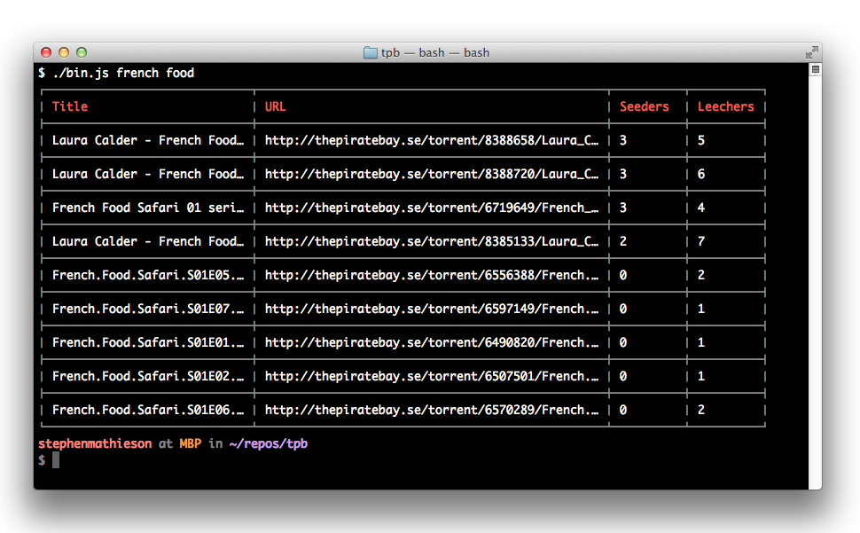

# tpb

  Search [The Pirate Bay](http://thepiratebay.se/) for torrents.

## API

### var Search = require('tpb')

  Require the module.

### var search = new Search(terms...)

  Create a new `Search` for the given `terms`.

#### search.page(n)

  Set the search page to `n`.

  Defaults to `0`.

#### search.filter(filter)

  Set the search `filter`.

  Avalible filters are:

  - relevance
  - type
  - name
  - date
  - size
  - uploader
  - seeders (*default*)
  - leechers

#### search.category(category)

  Set the search `category`.

  Available categories are::

  - audio
  - video (*default*)
  - applications
  - games
  - porn
  - other

#### search.query(fn)

  Query TPB with the given search `filter`, `page` and `category`.

  Invokes `fn(err, results)`.

## CLI

  A simple CLI has been bundled.  It looks like this:
  


  **HINT**: on osx hold cmd and dbl-click a url to open it in the browser. :)

### Usage

```
$ tpb --help

  Usage: tpb [options] <terms ...>

  Options:

    -h, --help                 output usage information
    -V, --version              output the version number
    -c, --category [category]  search category [video]
    -f, --filter [filter]      search filter [seeders]

```

## License

  MIT